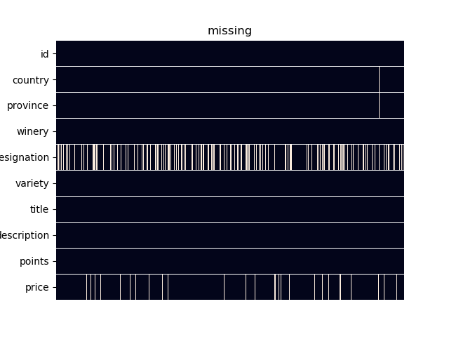
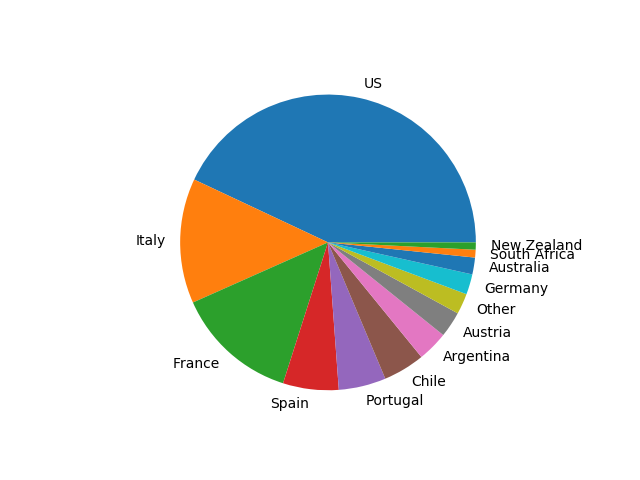
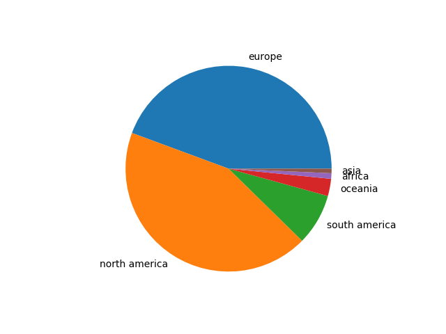

Отчет
=====
1\. Цели и задачи
-----------------
- Определить лучшие вина в ценовом сегменте до 100$ за бутылку исходя из данных датасета wine.csv
- Дать практические рекомендации по закупке вина для ресторанного бизнеса средней руки (casual/fine dining)

2\. Выбор данных
----------------

Из выборки исключены строки не содержащие
- цену
- описание

Также исключены:
- вина дороже 100$ (т.к. примеров для обоснованного количеством данных анализа мало, более того, для бизнеса информация о дорогих винах не ликвидна, поскольку дорогие вина в ресторанах средней руки не пользуются спросом, а поэтому не продаются, а поэтому не закупаются)

3\. Исходные данные
-------------------
В качестве исходных данных был взят датасет wine.csv, содержащий следующую информацию о 130000 вин:
- country - страна производства
- province - провинция/штат производства
- winery - винодельня
- designation - винограник
- variety - тип винограда
- title - название вина
- description - описание вина
- points - оценка вина экспертами
- price - цена за бутылку

4\. Дополнительные данные (FE)
------------------------------
- year - год производства (извлечен из названия)
- continent - континент производства (извлечен из стран, список стран и континентов взят из https://gist.github.com/pamelafox/986163, подправлен вручную)
- color - цвет вина (извлечен из винограда производства, список взят из https://en.wikipedia.org/wiki/List_of_grape_varieties)
- category - ценовая категория вина (из цены: <=15$ - 1, <=30$ - 2, <=50$ - 3, <=100$ - 4)

5\. Взгляд на данные
--------------------
- country - страна производства

|Country|Count|
|---|---|
|US|35878|
|Italy|11389|
|France|11192|
|Spain|5074|
|Portugal|4312|
|Chile|3793|
|Argentina|2785|
|Austria|2349|
|Germany|1851|

Страны, в которых производится менее 500 видов вина объединены в группу Other

- continent - континент производства

|Continent|Count|
|---|---|
|europe|37002|
|north america|36106|
|south america|6733|
|oceania|2259|
|africa|726|
|asia|588|

6\. Сегментация
---------------
Вина разбиты на четыре категории, а также в данном датасете на два цвета: красное и белое

В каждом сегменте предполагается выбрать лучшее вино

|||||
|---|---|---|---|
|<=15$ белое|<=30$ белое|<=50$ белое|<=100$ белое|
|<=15$ красное|<=30$ красное|<=50$ красное|<=100$ красное|

7\. Анализ без применения ML
----------------------------
Лучшие вина:

|||||
|---|---|---|---|
|Château Vincens 2011 Prestige Malbec-Merlot (Cahors) 13.0$ 93p|Donkey & Goat 2012 Grenache Noir Grenache (El Dorado) 27.0$ 96p|Pirouette 2008 Red Wine Red (Columbia Valley (WA)) 50.0$ 98p|Charles Smith 2006 Royal City Syrah (Columbia Valley (WA)) 80.0$ 100p|
|Osborne NV Pedro Ximenez 1827 Sweet Sherry Sherry (Jerez) 14.0$ 94p|Domaines Schlumberger 2014 Saering Grand Cru Riesling (Alsace) 29.0$ 96p|Failla 2010 Estate Vineyard Chardonnay (Sonoma Coast) 44.0$ 99p|Wayfarer 2014 Wayfarer Vineyard Chardonnay (Fort Ross-Seaview) 80.0$ 98p|

Лучшие вина по отношению оценка / цена:

|||||
|---|---|---|---|
|Cramele Recas 2011 UnWineD Pinot Grigio (Viile Timisului) 4.0$ 86p|David Hill 2010 Estate Pinot Gris (Willamette Valley) 16.0$ 93p|Windemere 2013 MacGregor Vineyard Pinot Noir (Edna Valley) 31.0$ 94p|Joseph Swan Vineyards 2007 Trenton Estate Vineyard Pinot Noir (Russian River Valley) 52.0$ 97p|
|Pam's Cuties NV Unoaked Chardonnay (California) 4.0$ 83p|Uvaggio 2010 Secco Moscato Giallo (Lodi) 16.0$ 94p|Pieropan 2011 La Rocca  (Soave Classico) 31.0$ 95p|Salomon-Undhof 2015 Steiner Kögl Reserve Riesling (Kremstal) 51.0$ 95p|

Лучшие цены при изменении оценки по формуле new_points = (points – E(points))**3:

|||||
|---|---|---|---|
|Château d'Aydie 2010 Aydie l'Origine Tannat-Cabernet Franc (Madiran) 12.0$ 93p|Donkey & Goat 2012 Grenache Noir Grenache (El Dorado) 27.0$ 96p|Donkey & Goat 2010 Fenaughty Vineyard Syrah (El Dorado) 35.0$ 97p|Charles Smith 2006 Royal City Syrah (Columbia Valley (WA)) 80.0$ 100p|
|Quinta dos Murças 2011 Assobio Red (Douro) 13.0$ 94p|The Eyrie Vineyards 2014 Estate Chardonnay (Dundee Hills) 27.0$ 96p|Failla 2010 Estate Vineyard Chardonnay (Sonoma Coast) 44.0$ 99p|Wayfarer 2014 Wayfarer Vineyard Chardonnay (Fort Ross-Seaview) 80.0$ 98p|
